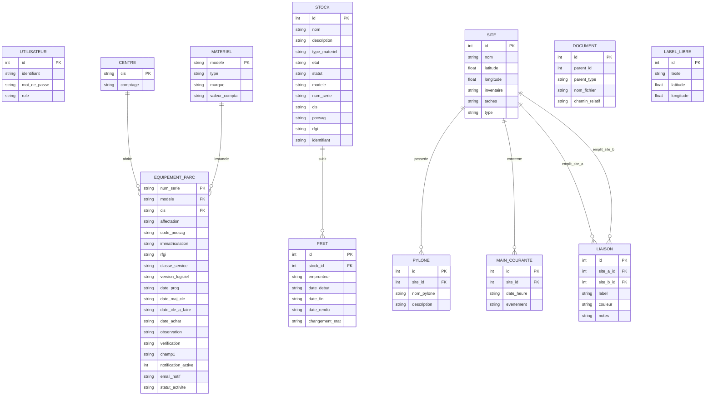

# Modèle Conceptuel de Données (MCD) - DolphiSIC

Ce document présente le Modèle Conceptuel de Données (MCD) des deux bases de données qui composent l'application **DolphiSIC** (`sdis04.db` et `carto_sdis04.db`).

---

## 1. Diagramme Entité-Association (Mermaid ERD)

---

## 2. Description des Associations et Cardinalités

### Base de données : `sdis04.db`

1. **CENTRE <-> EQUIPEMENT_PARC**
   - **Règle** : Un centre de secours (CIS) abrite de 0 à N équipements de parc. Un équipement appartient à au plus 1 centre d'affectation.
   - **Cardinalités** : `CENTRE (0,N) <--- affecte ---> (0,1) EQUIPEMENT_PARC`

2. **MATERIEL <-> EQUIPEMENT_PARC**
   - **Règle** : Un matériel de référence définit les propriétés communes de 0 à N terminaux physiques dans le parc. Un équipement physique correspond à 1 modèle de matériel unique.
   - **Cardinalités** : `MATERIEL (0,N) <--- definit ---> (1,1) EQUIPEMENT_PARC`

3. **STOCK <-> PRET**
   - **Règle** : Un matériel présent dans le stock peut faire l'objet de 0 à N prêts successifs dans le temps. Un prêt donné concerne 1 et 1 seul matériel du stock.
   - **Cardinalités** : `STOCK (0,N) <--- prete ---> (1,1) PRET`

### Base de données : `carto_sdis04.db`

1. **SITE <-> PYLONE**
   - **Règle** : Un site cartographique (point haut/perroquet) possède de 0 à N pylônes de relais. Un pylône est implanté sur 1 unique site.
   - **Cardinalités** : `SITE (0,N) <--- héberge ---> (1,1) PYLONE`

2. **SITE <-> MAIN_COURANTE**
   - **Règle** : Un site cartographique possède un historique d'événements de 0 à N lignes de main courante. Une ligne de main courante concerne 1 seul site.
   - **Cardinalités** : `SITE (0,N) <--- trace ---> (1,1) MAIN_COURANTE`

3. **SITE <-> LIAISON (Liaisons Radio)**
   - **Règle** : Une liaison radio s'établit entre deux sites (site A de départ, site B d'arrivée). Un site peut être impliqué dans 0 à N liaisons distinctes.
   - **Cardinalités** :
     - `SITE (0,N) <--- origine ---> (1,1) LIAISON`
     - `SITE (0,N) <--- destination ---> (1,1) LIAISON`

4. **DOCUMENT (Polymorphisme Conceptuel)**
   - **Règle** : Un document (PDF, photo, schéma) est attaché à un site ou à une liaison (`parent_type` détermine la table liée et `parent_id` contient l'identifiant).
